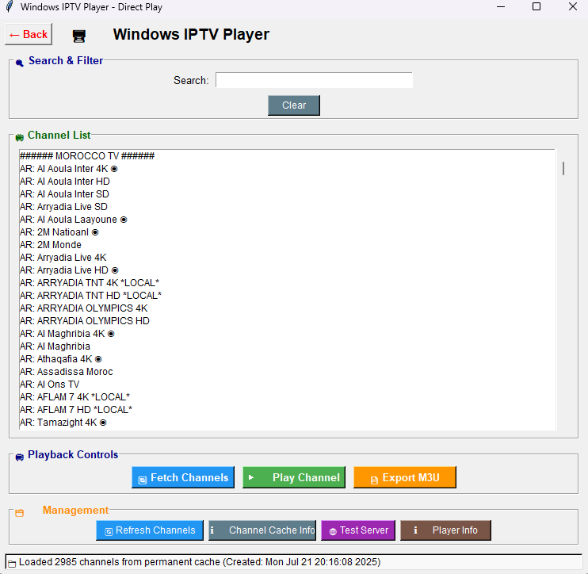

# Windows IPTV Player

A simple IPTV player for Windows using Python and Tkinter. Fetch and play IPTV channels using MAC authentication.




---

## Download

**Windows EXE:**  
[Download Player](https://github.com/2saleh1/Windows-MAC-IPTV-Player/releases/download/v1.0.5/MAC.IPTV.Player.exe)

---

## Features

- Save and switch between multiple IPTV users
- Fast channel search and filtering
- Add and manage favorite channels
- Delete users and clear user data
- Play streams instantly with ffplay (FFmpeg)
- Export channels to M3U playlist (for VLC and other players)
- Automatic channel caching for instant loading
- Batch channel list updates for smooth GUI
- Supports multiple IPTV portal types (MAG, Xtream, M3U, etc.)
- Handles token expiry and session refresh automatically
- Switch between light and dark themes
- Quick filter buttons for popular channel groups 
- Show only favorites or all channels
- Cache management and cleanup tools
- Detailed error messages and troubleshooting
- Automatic theme saving and restoring
- Test server connection tool


---

## Requirements

- Python 3.10+
- `requests` library
- FFmpeg (`ffplay`)

---

## Quick Start

1. **Install Python:**  
   [python.org/downloads](https://www.python.org/downloads/)

2. **Install dependencies:**  
   ```sh
   pip install -r requirements.txt
   ```

3. **Install FFmpeg:**  
   [ffmpeg.org/download.html](https://ffmpeg.org/download.html)  
   Add `C:\ffmpeg\bin` to PATH.

4. **Run the player:**  
   ```sh
   python player.py
   ```
   Or double-click `run.bat`.


---

## FFplay Controls

- `0` / `9`: Volume up/down
- `m`: Mute
- `c`: Cycle audio channels
- `a`: Cycle audio tracks

---

## Notes

- Check portal URL and MAC address if channels don’t load.
- Make sure `ffplay` works from the command
